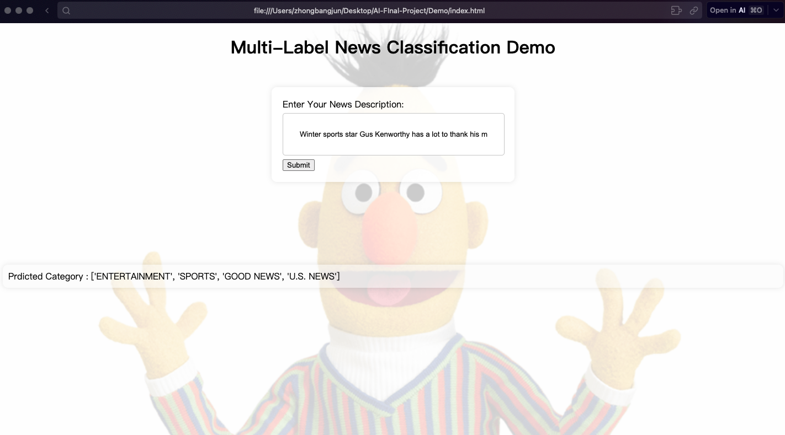

# AI-FInal-Project
## Introduction
This is the final project of Introduction to Artificial Intelligence in National Yang Ming Chiao Tung University. </br>
In these days, there are more and more complex types of news, such as crime, politics, sport, etc. Sometimes we only want to read some news that can let us feel relax, like entertainment, and sometimes, we want to care about some social issues. So, our group decided to develop a "Multi-Label" news classification system.
## Progress
1. Dataset Selection and Preparation. </br>
We select dataset from this [page](https://www.kaggle.com/datasets/timilsinabimal/newsarticlecategories). But this dataset is "Single-Label", so we need to "Re-Label" it. </br>
Some information about this dataset. </br>
 </br>
Total Number of Categories : 41
2. Training the first BERT model to "Re-Label" our dataset. </br>
3. Training the second BERT model to predict the given description of news. 
## Train Model
You can download the trained model from [HERE](https://drive.google.com/file/d/15CcUbjFIZtIBTVe6X2kuVq63n4-XgDtA/view?usp=sharing). Of course, you can train our model by yourself, but it may take a long time.
## Run
1. Clone our repository to your local machine.
```cpp=
git clone git@github.com:bonginn/AI-FInal-Project.git
```
2. Put the trained model into Model folder.
3. Goto our folder and Install some packages we need.
```cpp=
cd AI-Final-Project
pip install -r requirements.txt
```
4. Goto 'Demo' folder and Run the demo code.
```cpp=
cd Demo
python3 demo.py
```
After this step, you will see the following web : </br>
 </br>
Then, you can enter your news description in the input block, and you will see the predicted categories. </br>
 </br>


